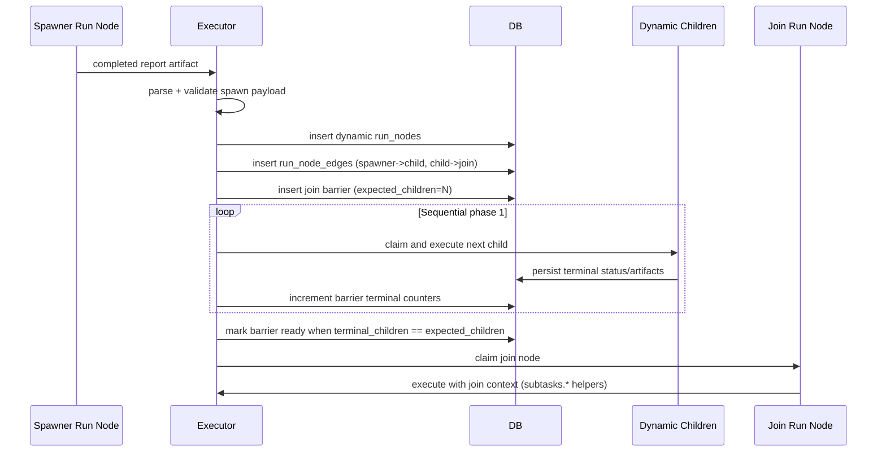
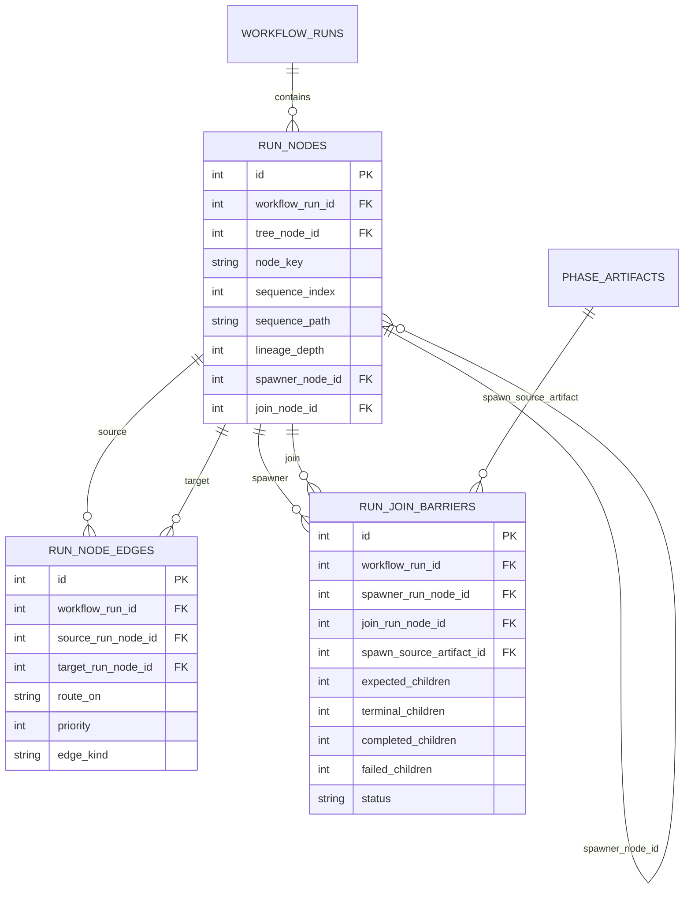

# Dynamic Node Creation (Fan-Out/Fan-In) Design v1

Status: Proposed for implementation (issue `#195`)  
Design issue: `#197`  
Prerequisite design: `packages/core/docs/retry-failure-summary-injection-v1.md` (`#196`, completed)  
Related policy: `packages/core/docs/upstream-artifact-handoff-policy-v1.md`

## Summary

This design adds dynamic runtime node creation to support fan-out/fan-in workflow patterns.

A `spawner` node can emit `N` subtask specs during execution. The executor validates this output, creates dynamic run nodes, and registers a join barrier. A `join` node becomes runnable only when all spawned siblings reach terminal state. In phase 1, fan-out execution remains sequential and deterministic.

## Objective

Deliver an implementation-ready design for issue `#195` that is:

- Deterministic in scheduling and context assembly.
- Compatible with existing routing and retry semantics.
- Forward-compatible with future parallel execution and nested fan-out.

## Non-goals (v1)

- No parallel fan-out execution in executor.
- No nested spawners beyond depth 1.
- No new guard expression language.
- No model-driven context compression in the executor.

## Alignment With Existing Design Docs

This design is intentionally aligned with:

- `DESIGN.md` runtime model (fresh sessions, deterministic state transitions, normalized SQL topology).
- Upstream artifact handoff policy (`MAX_UPSTREAM_ARTIFACTS = 4`, `MAX_CONTEXT_CHARS_TOTAL = 32_000`) by adding join-specific aggregation without removing deterministic bounds.
- Retry failure summary design (`#196`) so malformed spawner output and failed fan-out nodes can retry with prior-attempt summaries.

## Current Constraints

Current runtime constraints that this design resolves:

- `materializeWorkflowRunFromTree` creates a static 1:1 run-node set at run start.
- `tree_nodes.node_type` currently allows only `agent | human | tool`.
- `run_nodes` currently has unique `(workflow_run_id, sequence_index)` and no dynamic lineage field.
- `selectNextRunnableNode` only reasons about static topology/routing today.
- Dashboard run snapshots do not expose dynamic lineage/group metadata.

## Architecture

## Node Roles

Introduce a topology role alongside existing `node_type`:

- `standard`: current behavior.
- `spawner`: agent node whose terminal report is parsed as subtask specs.
- `join`: agent node that waits on a barrier from one spawner execution.

`node_type` remains the phase execution kind (`agent | human | tool`); in phase 1, `spawner` and `join` roles are restricted to `node_type = 'agent'`.

## Runtime Creation Flow

1. Executor claims and runs a `spawner` node normally.
2. On success, executor parses/validates spawner output contract.
3. Executor enforces `maxChildren` and depth guard.
4. Executor creates dynamic child `run_nodes` and dynamic `run_node_edges`.
5. Executor registers a join barrier row for this spawn event.
6. Scheduler continues sequentially through child nodes.
7. Join barrier transitions to ready when all siblings are terminal.
8. Join node becomes runnable and executes with aggregated subtask context.



## Interaction With Routing Selection

`routing-selection.ts` remains authoritative for static success/failure route selection.

Phase 1 additions:

- Add runtime edge loading (`run_node_edges`) and merge it with static edge applicability.
- Add join-barrier gate in node selection:
  - A join node with an active barrier is runnable only when barrier `status = ready`.
  - Barrier readiness is based on sibling terminality, not on guarded decision values from sibling reports.
- Keep downstream guard behavior unchanged: guards evaluate the join report as usual.

## Schema Changes

## `tree_nodes`

Add role/config fields:

- `node_role` text, non-null, default `standard`, check in `('standard', 'spawner', 'join')`.
- `max_children` integer, non-null, default `12`, check `>= 0`.

Constraints:

- If `node_role in ('spawner', 'join')`, require `node_type = 'agent'`.
- If `node_role = 'spawner'`, require exactly one static success edge to a `join` node target.

## `run_nodes`

Add lineage/grouping fields:

- `spawner_node_id` nullable FK to `run_nodes.id` (same `workflow_run_id` enforced via trigger).
- `join_node_id` nullable FK to `run_nodes.id` (target join node for dynamic children).
- `lineage_depth` integer non-null default `0`.
- `sequence_path` text nullable (display/debug ordering path; examples: `2`, `2.1`, `2.2`).

Notes:

- `sequence_index` uniqueness remains unchanged and continues to provide deterministic scheduler order.
- Dynamic children receive monotonically increasing run-local `sequence_index` values at insertion time.

## New table: `run_node_edges`

Runtime edge records (static and dynamic) for scheduler resolution:

- `id` PK
- `workflow_run_id` FK
- `source_run_node_id` FK
- `target_run_node_id` FK
- `route_on` text check in `('success', 'failure', 'terminal')`
- `priority` integer non-null default `0`
- `edge_kind` text check in `('tree', 'dynamic_spawner_to_child', 'dynamic_child_to_join')`
- `created_at`

Indexes:

- Unique `(workflow_run_id, source_run_node_id, route_on, priority, target_run_node_id)`
- `(workflow_run_id, target_run_node_id)` for runnable checks
- `(workflow_run_id, source_run_node_id)` for routing updates

## New table: `run_join_barriers`

Barrier bookkeeping per spawn event:

- `id` PK
- `workflow_run_id` FK
- `spawner_run_node_id` FK
- `join_run_node_id` FK
- `spawn_source_artifact_id` FK to `phase_artifacts.id`
- `expected_children` integer
- `terminal_children` integer
- `completed_children` integer
- `failed_children` integer
- `status` text check in `('pending', 'ready', 'released', 'cancelled')`
- `created_at`, `updated_at`, `released_at`

Indexes:

- Unique `(workflow_run_id, spawner_run_node_id, spawn_source_artifact_id)`
- `(workflow_run_id, join_run_node_id, status)`

## Schema Relationship Diagram



## Spawner Output Contract

Spawner terminal output must be strict JSON (object) matching:

```json
{
  "schemaVersion": 1,
  "subtasks": [
    {
      "nodeKey": "api-tests",
      "title": "Add API retry tests",
      "prompt": "Implement retry tests for ...",
      "provider": "codex",
      "model": "gpt-5-codex",
      "metadata": {
        "component": "packages/core"
      }
    }
  ]
}
```

Validation rules:

- `schemaVersion` must be `1`.
- `subtasks` must be an array with length `0..maxChildren`.
- Each subtask requires non-empty `title` and `prompt`.
- Optional `nodeKey` must be unique within the spawn payload and normalized to slug format.
- Optional provider/model overrides must pass existing provider/model validation.
- `metadata` must be JSON-object if present.

Key generation:

- If `nodeKey` omitted, generate deterministic `nodeKey = <spawnerNodeKey>__<index>`.

Malformed output handling:

- Parsing/validation errors fail the spawner attempt with typed error `SPAWNER_OUTPUT_INVALID`.
- Normal retry path applies (`maxRetries` + `#196` failure summary injection).
- If retries are exhausted, existing failure route/terminal behavior applies.

## Join Node Semantics

## Fan-in synchronization

Join runnability is gated by `run_join_barriers`:

- Barrier tracks `expected_children` and terminal counters.
- Terminal sibling statuses for barrier accounting: `completed`, `failed`, `skipped`, `cancelled`.
- Join is claimable when barrier reaches `status = ready`.

## Join context assembly

Join receives both:

- Existing upstream artifact envelopes (policy v1 bounded behavior).
- A join-specific summary entry, `ALPHRED_JOIN_SUBTASKS v1`, containing:
  - `subtasks.total`
  - `subtasks.succeeded`
  - `subtasks.failed`
  - `subtasks.terminal`
  - Per-subtask compact status rows with artifact/error summary previews.

## Failed siblings behavior

Join still executes when any siblings failed.

Injected helper context includes failure information for each failed sibling. Join decides whether to proceed, request re-decomposition, or fail via its normal report and downstream guards.

## Nesting Guard (Depth 1)

Phase 1 rule:

- A spawner cannot create a child that is itself a spawner at runtime.
- Runtime check computes `childDepth = parentDepth + 1` via `spawner_node_id` lineage.
- If `childDepth > 1`, fail spawn with typed error `SPAWNER_DEPTH_EXCEEDED`.

Forward compatibility:

- `spawner_node_id` + `lineage_depth` already supports depth > 1 without migration.
- Phase 3 can relax the runtime guard and introduce configurable `maxDepth`.

## Dashboard UX

## Data model/API additions

Extend `DashboardRunNodeSnapshot` with:

- `nodeRole: 'standard' | 'spawner' | 'join'`
- `spawnerNodeId: number | null`
- `joinNodeId: number | null`
- `lineageDepth: number`

Add grouped run detail payload section:

- `fanOutGroups[]` entries keyed by `(spawnerNodeId, joinNodeId, spawnSourceArtifactId)` with counts and child IDs.

## Rendering/interaction

- Render each spawner as a collapsed fan-out group by default.
- Summary example: `Decompose: 7/9 terminal (5 completed, 2 failed)`.
- Expand/collapse reveals individual child nodes and statuses.
- Join node references the group summary and highlights readiness (`waiting` vs `ready`).

## Real-time behavior

- When spawner creates children, polling/SSE updates append children to group in-place.
- Group counters update as children complete/fail.
- Join state updates immediately when barrier reaches ready.

## Context Budget Strategy

## Options considered

1. Raise global caps for join nodes.
2. Keep caps and include only first `K` subtasks.
3. Keep caps, add deterministic all-subtask summary + prioritized full artifacts.
4. Paginate join context across multiple join attempts.

## Recommendation (v1)

Use option 3:

- Keep global policy defaults unchanged.
- Reserve a join summary budget (`JOIN_SUMMARY_RESERVED_CHARS = 8_000`).
- Include deterministic compact status for all subtasks in the summary entry.
- Include full report envelopes for at most `4` children, prioritized:
  1. failed siblings
  2. succeeded siblings by recency

Rationale:

- Preserves deterministic bounded context behavior.
- Prevents silent loss of failure visibility when `N` is large.
- Avoids broad policy changes that affect non-join nodes.

## Incremental Delivery Plan

## Phase 1

- `node_role` support (`standard`, `spawner`, `join`).
- Runtime spawn parsing/validation.
- Dynamic run-node + run-edge creation.
- Join barrier tracking.
- Sequential child execution.
- `maxChildren` enforcement.
- Dashboard collapsed fan-out group UI.

## Phase 2

- Parallel child execution with global concurrency limits.
- Barrier updates under concurrent completion.
- Fair scheduler and cancellation safety under parallel claims.

## Phase 3

- Nested fan-out with configurable `maxDepth`.
- Optional per-role concurrency ceilings.
- Enhanced join aggregation for deep hierarchies.

## Migration path across phases

- Phase 1 introduces all lineage/barrier schema primitives.
- Phase 2 consumes the same schema; no destructive migration required.
- Phase 3 lifts runtime depth guard and adds config only.

## Edge Cases

- Spawner outputs `0` subtasks:
  - create barrier with `expected_children = 0`, mark `ready`, join can execute immediately.
- Spawner outputs `1` subtask:
  - degenerate fan-out; still uses barrier path for consistency.
- All subtasks fail:
  - join still executes with `subtasks.succeeded = 0`, `subtasks.failed = N`.
- Run paused/cancelled mid-fan-out:
  - children and join obey existing pause/cancel semantics; no new claims while paused/cancelled.
- Operator retries failed run:
  - existing retry mechanism re-queues failed latest attempts, including dynamic children/join nodes.
  - barrier counters are recomputed from latest run-node statuses before join runnability checks.

## Testing Strategy

## Unit tests

- Spawner contract parsing and strict validation.
- `maxChildren` enforcement and error taxonomy.
- Depth guard (`SPAWNER_DEPTH_EXCEEDED`).
- Dynamic sequence allocation and `sequence_path` derivation.
- Barrier terminal counter updates and ready transition.
- Join helper context shape (`subtasks.total/succeeded/failed`).

## Integration tests

- Full fan-out/fan-in sequential execution.
- `0`, `1`, and `N` subtask flows.
- Partial-failure join behavior.
- Pause/resume/cancel mid-fan-out.
- Retry run behavior with dynamic nodes.

## Dashboard component tests

- Collapsed group rendering with accurate summary counts.
- Expand/collapse semantics and keyboard accessibility.
- Real-time appearance of spawned children and join readiness state.

## E2E test

- Workflow: design doc -> decompose -> subtasks -> review.
- Assert dynamic nodes appear, join waits for terminal siblings, and review receives aggregated context.

## Risks and Mitigations

- Risk: scheduler regressions from mixed static/dynamic edge resolution.
  - Mitigation: isolate runtime-edge selection logic and keep static routing-selection contracts intact.
- Risk: context bloat at join for large `N`.
  - Mitigation: deterministic reserved-budget summary + strict full-artifact cap.
- Risk: UI complexity around grouped dynamic nodes.
  - Mitigation: additive API fields and grouped projection, preserve existing node list fallback.

## Follow-up Tasks / Open Clarifications

- Decide strict default for `maxChildren` overflow behavior:
  - fail fast (recommended for determinism), or truncate with diagnostics.
- Decide whether `nodeKey` collisions against existing run-node keys should fail or auto-suffix.
- Confirm whether phase 1 should explicitly block workflows that route back into a spawner after join.

## References

- Issue `#195` (implementation target)
- Issue `#197` (this design task)
- Issue `#196` (retry summary prerequisite)
- `packages/core/docs/upstream-artifact-handoff-policy-v1.md`
- `packages/core/docs/retry-failure-summary-injection-v1.md`
